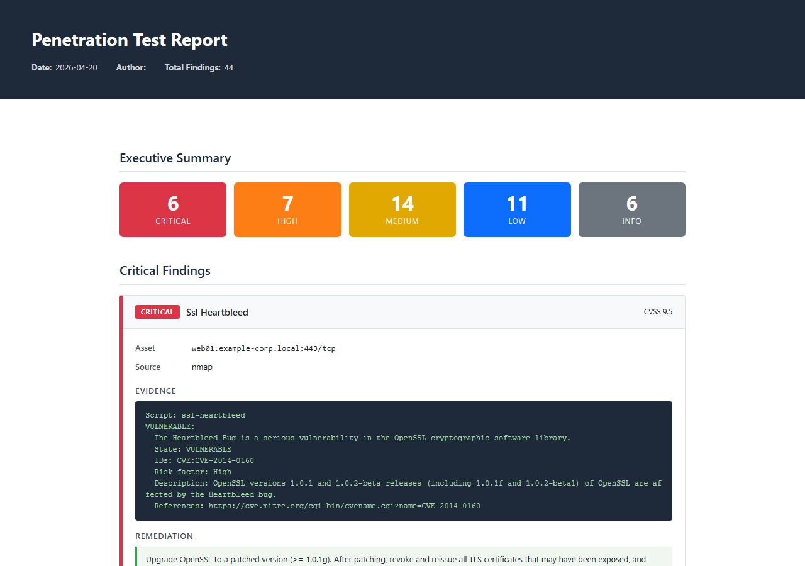

# EZReport

A command-line tool that ingests raw output from common pentest tools, normalises it into a unified schema, deduplicates findings, applies remediation guidance, and emits a polished client-ready report in HTML, Markdown, or DOCX.



---

## Supported input formats

| Tool | Format |
|------|--------|
| **nmap** | XML (`-oX`) |
| **nuclei** | JSONL (`-o`) |
| **testssl.sh** | JSON (`--jsonfile`) |
| **nikto** | XML (`-Format xml`) |
| **ffuf** | JSON (`-o -of json`) |

Format is detected automatically — no flags needed.

---

## Install

```bash
pip install -r requirements.txt
```

---

## Usage

```bash
# HTML report (default)
python ezreport.py nmap.xml nuclei.json testssl.json nikto.xml ffuf.json -o report.html

# DOCX for client delivery
python ezreport.py *.xml *.json -f docx --title "ACME Corp — Q2 Pentest" --author "Your Name"

# Markdown + raw JSON dump
python ezreport.py nmap.xml -f md --dump-json
```

### All options

```
positional:
  files                 Tool output files to parse (globs accepted)

optional:
  -f, --format          md | html | docx  (default: html)
  -o, --output          Output file path (auto-named if omitted)
  --title               Report title
  --author              Author name
  --scope               Engagement scope description
  --no-enrich           Skip remediation enrichment
  --dump-json           Also write normalized_findings.json
```

---

## How it works

```
tool output files
      │
      ▼
  [parsers.py]         auto-detect format → parse into Finding objects
      │
      ▼
  [ezreport.py]        deduplicate on (title, asset) — merge evidence on collision
      │
      ▼
  [findings.py]        enrich: fill CVSS scores, map CWE IDs, inject remediation text
      │
      ▼
  [reports.py]         render HTML / Markdown / DOCX
```

Remediation text is resolved in priority order: CWE lookup → title keyword match → severity-level fallback. All text is written at consulting-deliverable quality.

---

## Project structure

```
ezreport.py        CLI entry point — arg parsing, orchestration
findings.py        Finding dataclass + enrichment logic (CWE map, remediation library)
parsers.py         One parser class per tool, auto-detected via can_parse()
reports.py         MarkdownReport, HtmlReport, DocxReport
templates/
  report.html.jinja2   Self-contained HTML template (no external CDN)
tool_output/       Synthetic sample data for the demo
docs/
  report_preview.png
```

---

## Demo

The `tool_output/` directory contains synthetic sample data (fictional hostnames, RFC 1918 IPs, no real client data). Run the full pipeline with:

```bash
python ezreport.py tool_output/*.xml tool_output/*.json -o example_report.html
```

The generated `example_report.html` is committed to the repo so you can preview it directly.

---

## Similar tools

[Ghostwriter](https://github.com/GhostManager/Ghostwriter) and [Dradis](https://dradisframework.com/) are collaborative platforms built around a persistent project database. EZReport is intentionally the opposite: a zero-infrastructure CLI that takes raw tool output and produces a deliverable in a single command, with no account, no server, and no import workflow.
